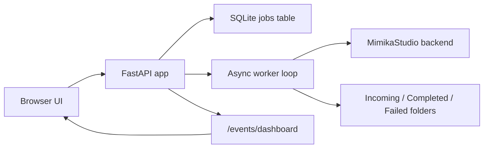

# Architecture

## Overview

BookForge is a single FastAPI application with:

- Jinja2 server-rendered pages.
- Vanilla JavaScript for live dashboard and upload voice preview.
- SQLite for local queue persistence.
- Background async worker started from the FastAPI lifespan.
- `httpx` client for MimikaStudio API calls.
- YAML config persisted to `config.yaml`.

## Request Flow

## Core Modules

`app/main.py`

- FastAPI app and routes.
- Login/logout.
- Auth middleware.
- Dashboard page.
- SSE stream.
- Upload and settings routes.
- Job action routes.

`app/worker.py`

- Runs every few seconds.
- Starts queued jobs up to `max_parallel_jobs`.
- Polls running Mimika jobs.
- Copies completed outputs.
- Moves failed inputs to archive.

`app/mimika_client.py`

- Wraps MimikaStudio API.
- Extracts job IDs from multiple possible response shapes.
- Normalizes status fields from multiple possible response shapes.
- Fetches voices and audio/job lists.

`app/db.py`

- Owns SQLite connection helpers.
- Creates/migrates the `jobs` table.
- Creates, lists, updates, deletes jobs.
- Provides status counts.

`app/config.py`

- `Settings` dataclass.
- Loads `config.yaml`.
- Copies `config.yaml.example` if missing.
- Saves settings back to YAML.
- Ensures configured directories exist.

`app/system_metrics.py`

- Collects CPU/RAM/GPU data.
- Linux RAM from `/proc/meminfo`.
- macOS RAM from `sysctl` and `vm_stat`.
- macOS GPU from narrow `sudo -n powermetrics` command.

## Dashboard Live Updates

Dashboard is intentionally not HTMX polling anymore.

Current live update flow:

- Browser opens `/`.
- Initial HTML renders current dashboard.
- `app/static/dashboard.js` opens `EventSource("/events/dashboard")`.
- Server emits compact JSON.
- JS updates metrics and table body.
- Selected job checkboxes are preserved across updates.

Relevant files:

- `app/templates/dashboard.html`
- `app/templates/partials/dashboard_sections.html`
- `app/static/dashboard.js`
- `app/main.py` functions `dashboard_events()` and `dashboard_state()`

## Configurable Settings

Settings are edited at `/settings` and persisted to `config.yaml`.

Fields include:

- Mimika backend URL.
- Max parallel jobs.
- Dashboard SSE interval.
- Default voice.
- Default speed.
- Default output format.
- Default subtitle format.
- Auto-copy to Audiobookshelf.
- Incoming/work/completed/failed/Audiobookshelf paths.
- Max upload size.

